# Catbook - 고양이의 종류와 특징

## 고양이 목록 예시

| 고양이 이름 |
| :---: |  
| 고양이 이미지 |  
| 고양이 속성 |  
| 고양이 성격 |
| 고양이 전투력 |

### 일반 고양이

***
| 시로네코상 / Snowball | 쿠로네코상 / Smokey | 시로쿠로상 / Spots | 하이이로상 / Shadow |  
| :---: | :---: | :---: | :---: |
| 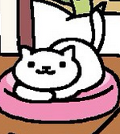 | 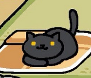 | 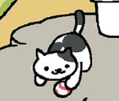 | 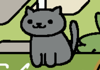 |  
| 흰색 | 검은색 | 흑백 | 잿빛 | 
| 여유로움 | 츤데레 | 경솔함 | 신비함 |
| 80 | 140 | 75 | 50 |
***
| 토비미케상 / Sunny | 챠토라상 / Fred | 시로챠토라상 / Pumpkin | 미케상 / Callie |  
| :---: | :---: | :---: | :---: |
| 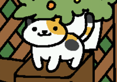 | 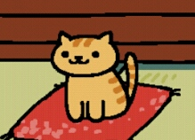 | 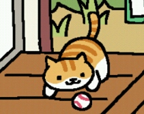 | 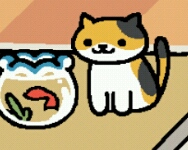 |  
| 띄엄띄엄 삼색 | 갈색 줄무늬 | 흰배 갈색줄무늬 | 삼색 |  
| 말괄량이 | 바람둥이 | 멍함 | 느긋함 |
| 120 | 120 | 90 | 50 |
***
| 시마미케상 / Tabitha | 사비가라상 / Bandit | 하치와레상 / Gabriel | 포인트상 / Marshmallow |  
| :---: | :---: | :---: | :---: |
| 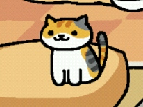 | 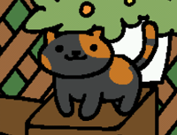 | 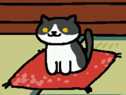 | 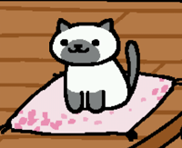 |  
| 줄무늬 삼색 | 거북등 | 턱시도 | 포인티드 |  
| 슬로우 라이프 | 와일드 | 착실함 | 츤츤 |
| 40 | 180 | 150 | 170 |

### 레어 고양이

***
| 타테지마상 / Joe Dimeowgio | 나가구츠상 / Senor Don Gato | 만조쿠상 / Tubbs | 미카즈키상 / Hermeowne |  
| :---: | :---: | :---: | :---: |
| 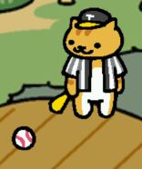 | 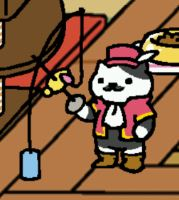 | 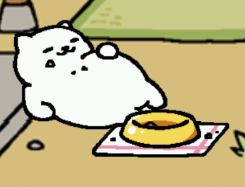 |  |
| 야구공 | 쥐돌이 |고급 사료, 캔, 생선회, 빅쿠션|달걀침대|
| 세로 줄무늬, 야구광 | 조금기른 콧수염 | 푹신푹신 | 뾰족모자 |  
| 열광, 팀플레이 | 책략가 | 쏜살같음 | 온순함 |
| 28 | 30 | 130 | 200 |