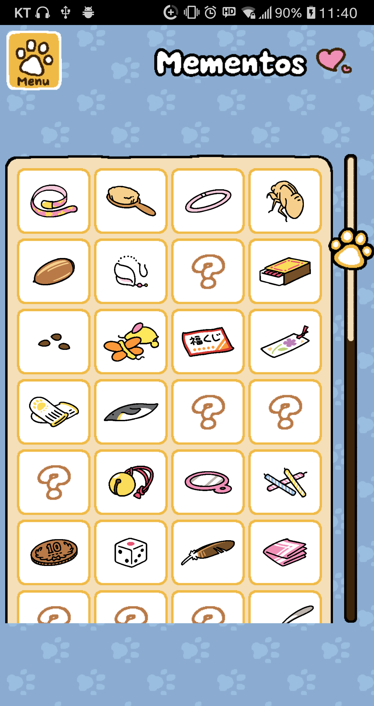

# Mementos / 보물

 

고양이들이 남기고 간 보물들을 전시되어 있다.  
고양이들은 놀다가 자기가 원하면 보물은 남기고 간다. 보물을 줄 가능성은 랜덤이다.  
보물이 있으면 게임을 시작할 때 하면이 어두워진다. 보물을 남기고 간 고양이만 선명하게 보이고, 고양이는 오른쪽에서 중앙으로 걸어온다. 고양이는 가운데 도달하면 가만히 앉아있고 정면을 바라본다.  
이 후 화면을 클릭하면 고양이 위에 보물이 화려하게 나타나고, 고양이 밑에는  
'You received a [memento] from (고양이 이름).'  
라는 메시지가 뜬다. 또 클릭하면 화면은 다시 정상으로 돌아온다.

보물들 칸은 4열로 배치되어 있고, 옆에 있는 스크롤로 위아래로 이동할 수 있다.  
고양이마다 남기고 가는 보물이 다르며, 각 보물마다 보물 메뉴에서 들어갈 칸이 정해져 있다. 만약 칸에 해당되는 보물을 아직 못 받았으면 물음표가 그려져 있다.  
보물을 클릭하면 보물 이미지가 좀 더 크게 표시되고, 이미지 위에는 보물 이름, 아래에는 보물에 대한 짧은 설명이 있다. 이때 보물 이름 오른쪽 위 모서리에는 보물을 선물한 고양이의 얼굴이 있다.

대부분의 보물들을 단순한 장식용이고, 게임에 영향을 주지 않는다.

* * *

## 보물 목록 예시

| 보물 이름 |  
| 보물 이미지 |  
| 선물한 고양이 이름 |  
| 보물 설명 |

### 일반 고양이 보물

| Flowered Collar | Soft Brush | Glow Bracelet | Cicada Skin |  
| ![memento_snowball][memento_snowball] | ![memento_smokey][memento_smokey] | ![memento_spots][memento_spots] | ![memento_shadow][memento_shadow] |  
| Snowball | Smokey | Spots | Shadow |  
| A small collar with a flower print pattern. | A soft brush for fur. | Something to wear at evening events. | The cast-off skin from a molting cicada. |

| Shiny Acorn | Seashell Earring | Aluminum Pins | Damp Matchbox |  
| ![memento_sunny][memento_sunny] | ![memento_fred][memento_fred] | ![memento_pumpkin][memento_pumpkin] | ![memento_callie][memento_callie] |  
| Sunny | Fred | Pumpkin | Callie |  
| An acorn with a shiny shell. | A lovely drop earring with a small seashell. | They make rattling noises when you shake them. | The matches are too damp to light. |

| Random Seeds | Teaser Toy Tip | Raffle Ticket | Flower Bookmark |  
| ![memento_tabitha][memento_tabitha] | ![memento_bandit][memento_bandit] | ![memento_gabriel][memento_gabriel] | ![memento_marshmallow][memento_marshmallow] |  
| Tabitha | Bandit | Gabriel | Marshmallow |  
| Random seeds. | A trophy from a hard-fought battle? | A ticket for a store raffle. | A bookmark made from a purple pressed flower. |

### 특수 고양이 보물

| Signed Baseball | Feathered Hat | Fish Jerky | Small Glass Bottle |  
| ![memento_dimeowgio][memento_dimeowgio] | ![memento_dongato][memento_dongato] | ![memento_tubbs][memento_tubbs] | ![memento_hermeowne][memento_hermeowne] |  
| Joe DiMeowgio | Senor Don Gato | Tubbs | Hermeowne |  
| A baseball with someone's autograph. | An attractive hat decorated with feathers. | Piece of dried fish covered in claw marks. | It contains soft, fine powder. |

Small Glass Bottle은 다른 보물들과는 다르게 사용이 가능하다. 사용하면 빈 마당에 고양이들이 나타난다. 마지막 사용한지 며칠이 지났는지에 따라 이미지가 달라진다. 사용한지 오래 됐을 수록 병 속 가루가 많다. 
![hermeowne_memento_progress][hermeowne_memento_progress]

[memento_snowball]: https://vignette.wikia.nocookie.net/nekoatsume/images/2/24/Memento_snowball.png/revision/latest/scale-to-width-down/80?cb=20151108130138
[memento_smokey]: https://vignette.wikia.nocookie.net/nekoatsume/images/c/ce/Memento_smokey.png/revision/latest/scale-to-width-down/80?cb=20151108130406
[memento_spots]: https://vignette.wikia.nocookie.net/nekoatsume/images/5/54/Memento_spots.png/revision/latest/scale-to-width-down/80?cb=20151108130620
[memento_shadow]: https://vignette.wikia.nocookie.net/nekoatsume/images/1/19/Memento_shadow.png/revision/latest/scale-to-width-down/60?cb=20151108130632
[memento_sunny]: https://vignette.wikia.nocookie.net/nekoatsume/images/a/a3/Memento_sunny.png/revision/latest/scale-to-width-down/70?cb=20151108133626
[memento_fred]: https://vignette.wikia.nocookie.net/nekoatsume/images/e/e9/Memento_fred.png/revision/latest/scale-to-width-down/70?cb=20151108134059
[memento_pumpkin]: https://vignette.wikia.nocookie.net/nekoatsume/images/6/6d/Memento_pumpkin.png/revision/latest/scale-to-width-down/80?cb=20151108134033
[memento_callie]: https://vignette.wikia.nocookie.net/nekoatsume/images/1/1f/Memento_callie.png/revision/latest/scale-to-width-down/80?cb=20151108134950
[memento_tabitha]: https://vignette.wikia.nocookie.net/nekoatsume/images/8/86/Memento_tabitha.png/revision/latest/scale-to-width-down/60?cb=20151108135008
[memento_bandit]: https://vignette.wikia.nocookie.net/nekoatsume/images/e/e5/Memento_bandit.png/revision/latest/scale-to-width-down/70?cb=20151108135024
[memento_gabriel]: https://vignette.wikia.nocookie.net/nekoatsume/images/f/f1/Memento_gabriel.png/revision/latest/scale-to-width-down/80?cb=20151108135100
[memento_marshmallow]: https://vignette.wikia.nocookie.net/nekoatsume/images/9/99/Memento_marshmallow.png/revision/latest/scale-to-width-down/70?cb=20151108135319
[memento_dimeowgio]:
https://vignette.wikia.nocookie.net/nekoatsume/images/1/15/Memento_joedimeowgio.png/revision/latest/scale-to-width-down/65?cb=20151108151733
[memento_dongato]:
https://vignette.wikia.nocookie.net/nekoatsume/images/6/6e/Memento_Senor_don_gato.png/revision/latest/scale-to-width-down/80?cb=20151111140446
[memento_tubbs]:
https://vignette.wikia.nocookie.net/nekoatsume/images/f/fa/Memento_tubbs.png/revision/latest/scale-to-width-down/80?cb=20151111135042
[memento_hermeowne]:
https://vignette.wikia.nocookie.net/nekoatsume/images/d/db/Memento_Hermeowne.png/revision/latest/scale-to-width-down/75?cb=20170723105621
[hermeowne_memento_progress]:
https://vignette.wikia.nocookie.net/nekoatsume/images/e/ea/Memento_Hermeowne2.png/revision/latest?cb=20170727152957