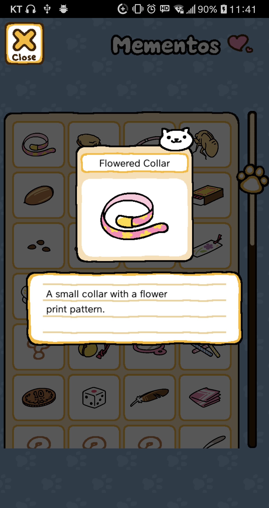

# 메뉴

대부분의 상황에서 좌측 상단에 위치함. 누르면 9개의 버튼이 3×3 배열로 표시됨

* * *

## 1. Cats

3개의 메뉴가 2×2배열로 표시됨

* * *

### Catbook

☞

* * *

### Album

찍은 사진을 볼 수 있음. Free Album과 고양이 전용 앨범으로 구분됨. 사진을 선택하면 좌측 상단에 두 버튼 나옴. 사진을 두번 누르면 대표사진으로 설정됨

  * Erase : 지우기

  * Move : 다른 앨범으로 이동

* * *

## Mementos

지금까지 받은 보물들을 볼 수 있음. 4열로 칸들이 배치되어 있고, 각 칸마다 정해진 보물들이 들어가 있다. 오른쪽에 있는 스크롤로 위아래로 더 탐색할 수 있다. 만약 해당 보물을 아직 못받았으면 물음표가 들어가 있다.  
칸을 클릭하면 보물을 확대해서 자세히 보여준다. 위에는 보물 이름이 있고, 오른쪽 위 모서리에는 그 보물을 선물한 고양이의 얼굴이 있다. 밑에는 보물에 대한 설명이 적혀 있다.

 

[자세히](Mementos.md)

* * *

## 2. Shop

☞

* * *

## 3. Goodies

☞

* * *

## 4. Camera

사진을 찍어 앨범에 저장할 수 있음

- 고양이 버튼 : 고양이 한 마리에 집중하여 찍음

- 풍경 버튼 : 화면 전체를 찍음

 

* * *

## 5. Yard

메인화면으로 이동

* * *

## 6. Gifts

고양이들이 주고가는 선물(멸치 등)이 표시됨. Accept 버튼을 누르면 받을 수 있으며, 하단의 Accept All 버튼으로 모두 한 번에 받을 수 있음

* * *

## 7. Settings

BGM, SFX, 언어, 저화질모드를 설정 변경할 수 있음. iOS는 저화질모드 대신 Support ID가 표시됨.

* * *

## 8. NEWS

직사각형 창이 표시됨. 윗줄에는 Review, Twitter버튼이, 아랫줄에는 다른 게임이 소개됨. 위의 말뚝에 일일 비밀번호가 표시됨

  - Review : 플레이 스토어(iOS는 앱스토어) 리뷰창으로 연결됨

  - Twitter : 공식 트위터로 연결됨

* * *

## 9. Other

3개의 메뉴가 2×2 배열로 표시됨

* * *

### Help

플레이 가이드. 항목을 누르면 설명을 보여줌

- 표시되는 항목 : Neko Atsume, Catbook, Album, Shop, Goodies, Gifts, Camera, Mementos, Settings, Connect

* * *

### Connect

  * Input Password : 패스워드 입력칸이 나옴. 일일보상 획득가능

  * Submit Feedback : 피드백을 보내는 창으로 연결

  * Official FAQ : 공식 사이트 FAQ로 연결됨

* * *

### Remodel

처음에는 안 보이다가, 새로운 장소를 해제하면 표시됨. 배경을 변경할 수 있음