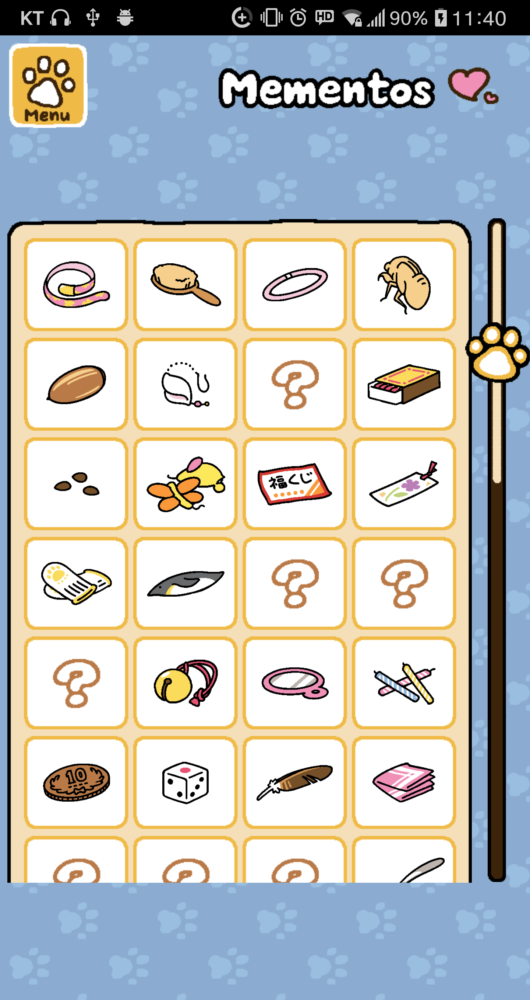

# 메뉴

대부분의 상황에서 좌측 상단에 위치함. 누르면 9개의 버튼이 3×3 배열로 표시됨

* * *

## 1. Cats

3개의 메뉴가 2×2배열로 표시됨

* * *

### Catbook

자신이 만났던 고양이들을 이곳에서 볼 수 있다.
Menu 버튼을 통해 메인메뉴를 불러올 수 있으며, 중앙의 각 버튼들을 누르면 고양이의 세부정보를 볼 수 있다.

아직 방문하지 못한 고양이는 이름이 ????로 표시되며, 방문한 고양이는 이름과 방문한 날짜가 표기되고, 사진을 찍을 수 있었던 고양이는 대표사진으로 설정한 사진과 함께 표기된다.

고양이 세부정보 창에는 고양이의 이름, 성격, 고양이의 전투력, 고양이의 속성, 방문횟수, 가장 많이 사용한 장난감, 엘범버튼, 그 고양이가 줄 수 있는 보물이 표기되어 있다.

 

[자세히](Catbook.md)

* * *

### Album

찍은 사진을 볼 수 있음. Free Album과 고양이 전용 앨범으로 구분됨. 사진을 선택하면 좌측 상단에 두 버튼 나옴. 사진을 두번 누르면 대표사진으로 설정됨

  * Erase : 지우기

  * Move : 다른 앨범으로 이동

* * *

## Mementos

지금까지 받은 보물들을 볼 수 있음. 4열로 칸들이 배치되어 있고, 각 칸마다 정해진 보물들이 들어가 있다. 오른쪽에 있는 스크롤로 위아래로 더 탐색할 수 있다. 만약 해당 보물을 아직 못받았으면 물음표가 들어가 있다.  
칸을 클릭하면 보물을 확대해서 자세히 보여준다. 위에는 보물 이름이 있고, 오른쪽 위 모서리에는 그 보물을 선물한 고양이의 얼굴이 있다. 밑에는 보물에 대한 설명이 적혀 있다.

 

[자세히](Mementos.md)

* * *

## 2. Shop

1. Menu : 메뉴 창 외에는 원래 상점의 배경이 어두워진 채로 뜬다.
   - Close : 원래 Menu 창 위치에 Close 버튼이 뜬다.
   - Menu : Menu 선택 브랜치로 이동한다.
2. Buy Goldfish : 이 버튼은 10초마다 한번씩 반짝인다.
   - Close : 원래 Menu 창 위치에 Close 버튼이 뜬다.
   - 멸치의 가격은 아래와 같다.
   - 
   
3. 상품 
   - 한번클릭
     - 해당 상품주변의 테두리가 빨간색으로 깜빡임
     - 아래의 메모창에 상품설명이 뜸
   - 두번클릭
     - "Purchase 상품이름?"문구가 뜨며 Yes/No 버튼이 뜬다.
     - 뒷 Shop배경이 어두워진다.
     - [창의공 상점.xlsx](https://github.com/JaeWookLim/ReverseProposal/blob/master/Reverse_Proposal/%EC%B0%BD%EC%9D%98%EA%B3%B5%20%EC%83%81%EC%A0%90.xlsx)
4. Page 버튼
   - 옆 페이지로 넘어간다.(스와이프로도 가능하며, 속도조절도 된다.)
   - 화면 오른쪽 아래의 Page x/49가 페이지 전환과 동시에 변화한다.
   - 상품의 종류는 다음과 같다.(링크)
4. Page 버튼
   - 옆 페이지로 넘어간다.(스와이프로도 가능하며, 속도조절도 된다.)
   - 화면 오른쪽 아래의 Page x/49가 페이지 전환과 동시에 변화한다.

* * *

## 3. Goodies

1. Menu : 메뉴 창 외에는 원래 상점의 배경이 어두워진 채로 뜬다.
   - Close : 원래 Menu 창 위치에 Close 버튼이 뜬다.
   - Menu : Menu 선택 브랜치로 이동한다.
2. Auto - set 
   - "Put away all of your goodies and automatically set out new once?"문구가 뜨며 Yes/No 버튼이 뜬다.
   - 뒷 Goodies 배경이 어두워진다.
3. 아이템
   - 한번클릭
     - 해당 아이템의 테두리가 빨간색으로 깜빡인다.
     - 아래 메모창에 정보가 뜬다.
   - 두번클릭
     - 원래 가진 아이템일 경우 Yard로 이동하며 해당 아이템 크기에 따라 place 할 수 있는 곳은 노란색 원, 못하는 곳은 빨간 원에 하얀 x가 표시됨. 노란 곳을 누르면 해당 아이템이 놓인다. 그 후 자동으로 Goodies 화면으로 돌아감
     - Yard에 비치된 아이템일 경우 "Put away 아이템이름?"문구가 뜨며 Yes/No/Tidy up 버튼이 뜨는데 Tidy up 버튼을 누를 경우 "Put away all of your goodies?"문구가 뜨며 Yes/No 버튼이 뜸
     - 없는 아이템일 경우 클릭불가
     - 뒷 Goodies배경 어두워진다.
4. Page 버튼 
   - 옆 페이지로 넘어간다.(스와이프로도 가능하며, 속도조절도 된다.)
   - 화면 오른쪽 아래의 Page x/y가 페이지 전환과 동시에 변화한다.(y = 가진 아이템 수/4)

* * *

## 4. Camera

사진을 찍어 앨범에 저장할 수 있음

- 고양이 버튼 : 고양이 한 마리에 집중하여 찍음

- 풍경 버튼 : 화면 전체를 찍음

 

* * *

## 5. Yard

메인화면으로 이동

* * *

## 6. Gifts

고양이들이 주고가는 선물(멸치 등)이 표시됨. Accept 버튼을 누르면 받을 수 있으며, 하단의 Accept All 버튼으로 모두 한 번에 받을 수 있음

* * *

## 7. Settings

BGM, SFX, 언어, 저화질모드를 설정 변경할 수 있음. iOS는 저화질모드 대신 Support ID가 표시됨.

* * *

## 8. NEWS

직사각형 창이 표시됨. 윗줄에는 Review, Twitter버튼이, 아랫줄에는 다른 게임이 소개됨. 위의 말뚝에 일일 비밀번호가 표시됨

  - Review : 플레이 스토어(iOS는 앱스토어) 리뷰창으로 연결됨

  - Twitter : 공식 트위터로 연결됨

* * *

## 9. Other

3개의 메뉴가 2×2 배열로 표시됨

* * *

### Help

플레이 가이드. 항목을 누르면 설명을 보여줌

- 표시되는 항목 : Neko Atsume, Catbook, Album, Shop, Goodies, Gifts, Camera, Mementos, Settings, Connect

* * *

### Connect

  * Input Password : 패스워드 입력칸이 나옴. 일일보상 획득가능

  * Submit Feedback : 피드백을 보내는 창으로 연결

  * Official FAQ : 공식 사이트 FAQ로 연결됨

* * *

### Remodel

처음에는 안 보이다가, 새로운 장소를 해제하면 표시됨. 배경을 변경할 수 있음
