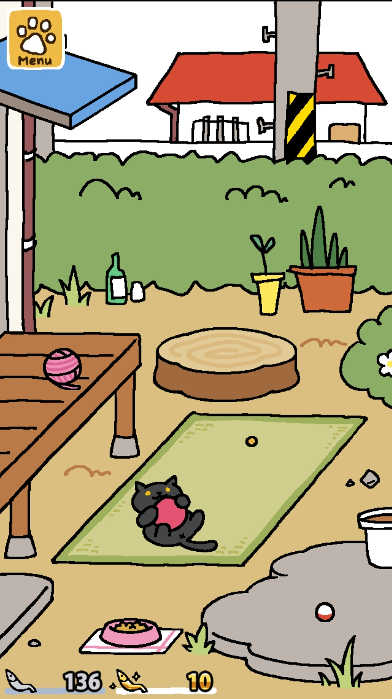
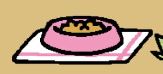
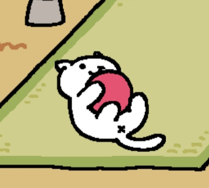
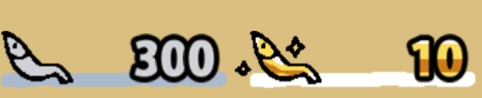

# 튜토리얼

[튜토리얼.md](https://github.com/JaeWookLim/ReverseProposal/blob/master/Reverse_Proposal/튜토리얼.md)

# 메인화면

* * *

- 메뉴 : 대부분의 상황에서 좌측 상단에 위치함. 누르면 9개의 버튼이 3×3 배열로 표시됨

  * 세부사항 : [메인화면-메뉴.md](https://github.com/JaeWookLim/ReverseProposal/blob/master/Reverse_Proposal/메인화면-메뉴.md)

* * *

- 밥그릇 : 누르면 사료를 보충할 수 있음

* * *

- 고양이 : 누르면 Catbook을 열 수 있음

* * * 

- 멸치 : 게임의 화폐 단위. 좌측 하단에 보여짐

  * 은멸치 : 기본 화폐

  * 금멸치 : 인앱결제로 얻을 수 있는 화폐

* * *

- 장소 : 메인화면에서 보여지는 배경

  * Classic Style(기본 스타일)

  * Zen Style(연못과 도코노마)

  * Rustic Style(우드 덱)

  * Modern Style(모던 스타일)

  * Western Style(서부극 스타일)

  * Sugary Style(스윗 가든)

  * Cafe Style(카페 스페이스)